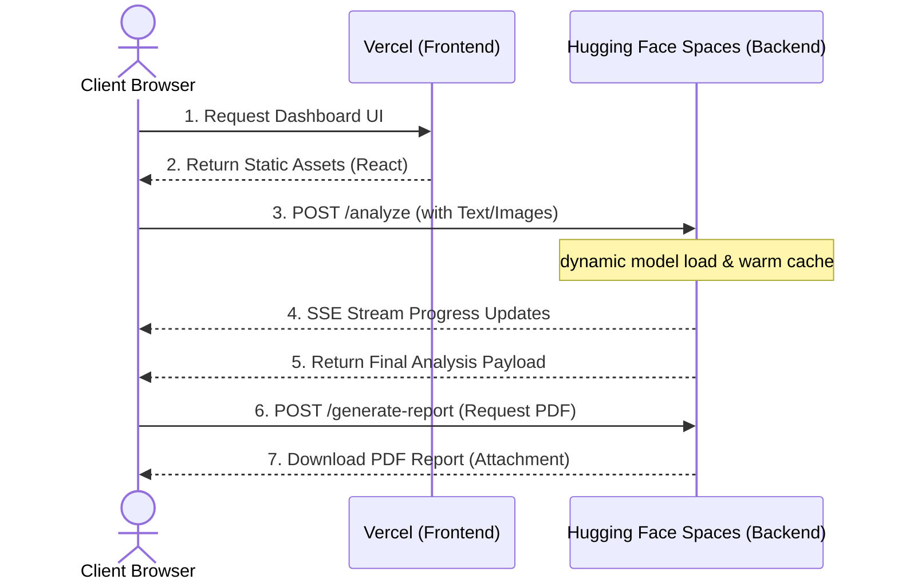

# 🌐 Enterprise Cloud Deployment Guide

This guide provides step-by-step instructions for deploying the **Multimodal Analyzer Dashboard** to production cloud environments completely for free.

---

## 🏗️ Architecture Overview

The system is configured as a decoupled monorepo:
*   **Backend**: Python FastAPI service running inside a container. Deployed to **Hugging Face Spaces** (Docker CPU-basic tier, 16GB RAM).
*   **Frontend**: React Vite client deployed to **Vercel** as a high-performance static site, communicating securely with the backend via HTTPS.



---

## 🧠 Backend Deployment: Hugging Face Spaces (Docker)

Hugging Face Spaces offers a free, production-ready **Docker Space** tier with **16GB RAM** and **8 vCPU cores**, which is perfectly suited for hosting our warm-cached deep learning model architecture.

### Step 1: Create a Hugging Face Space
1. Log in to [Hugging Face](https://huggingface.co/).
2. Click on your profile picture in the top-right corner and select **New Space**.
3. Configure the Space settings:
   * **Space Name**: `multimodal-analyzer-backend` (or a name of your choice).
   * **SDK**: Select **Docker**.
   * **Template**: Select **Blank** (or choose standard python/ubuntu base if prompted).
   * **Space License**: Select **MIT** (or preferred).
   * **Visibility**: Select **Public** (recommended for public API access).
4. Click **Create Space**.

### Step 2: Push Your Code
Hugging Face Spaces are backed by standard Git repositories. You can deploy instantly by pushing the repository to the Hugging Face remote.

1. Open your local terminal in the project root directory.
2. Add your Hugging Face Space repository as a new Git remote:
   ```bash
   git remote add hf https://huggingface.co/spaces/YOUR_HF_USERNAME/YOUR_SPACE_NAME
   ```
3. Deploy by pushing your code to the Hugging Face remote:
   ```bash
   git push -f hf main
   ```

> [!NOTE]
> Hugging Face will automatically read the root-level [Dockerfile](file:///c:/Users/DEV/Documents/GitHub/Multimodel-Analyzer-Assignment/Dockerfile), build the Docker image, download required base layers, and start the FastAPI server on port `7860`.

### Step 3: Get Your API Endpoint URL
Once the Space status changes to **Running**:
1. Click on the **three dots** in the top-right corner of the Space page.
2. Select **Embed this Space**.
3. Copy the **Direct URL** (it should look like `https://your_hf_username-your_space_name.hf.space`). This is your backend API endpoint.

---

## 🎨 Frontend Deployment: Vercel

Vercel is the premier platform for deploying React/Vite applications, offering instant CDNs, serverless capabilities, and free high-performance hosting.

### Step 1: Setup Vercel Import
1. Go to [Vercel](https://vercel.com/) and log in (or sign up using GitHub).
2. Click **Add New** -> **Project**.
3. Import your GitHub repository `Multimodel-Analyzer-Assignment`.

### Step 2: Configure Project Settings
In the Project Configuration panel, set the following parameters:
*   **Framework Preset**: Select **Vite**.
*   **Root Directory**: Set to `Frontend` (very important!).
*   **Build & Development Settings**: Keep defaults (`npm run build` / `dist`).

### Step 3: Configure Environment Variables
Expand the **Environment Variables** section and add the following variable:
*   **Key**: `VITE_API_URL`
*   **Value**: The **Direct URL** of your Hugging Face Space (e.g., `https://your_hf_username-your_space_name.hf.space`). Do **not** append a trailing slash.

### Step 4: Deploy!
1. Click **Deploy**.
2. Vercel will clone the repo, install node modules, build your production assets, and provision a free SSL-secured `.vercel.app` domain.
3. Click the deployment card to launch your live premium intelligence dashboard!

---

## 🔒 Security & CORS Optimizations

To ensure seamless production communications between the frontend and backend, the FastAPI backend uses robust CORS middleware:

```python
origins = [
    "http://localhost:3000",
    "http://localhost:5173",
    "https://your-vercel-deployment.vercel.app"  # Add your domain here
]
```

> [!TIP]
> If you experience CORS blockages after deploying, open [backend/main.py](file:///c:/Users/DEV/Documents/GitHub/Multimodel-Analyzer-Assignment/backend/main.py), append your Vercel deployment URL to the `origins` list, commit, and push back to your repository branches.
